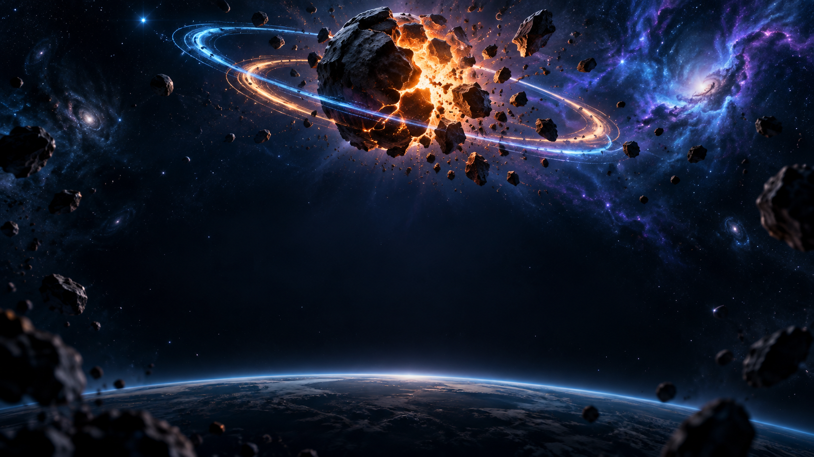

<div align="center">

<p align="center">
  <kbd> APPLE HIG CRAFTED</kbd> &nbsp;•&nbsp; <kbd>MULTI-PLATFORM READY</kbd> &nbsp;•&nbsp; <kbd>ZERO THIRD-PARTY WRAPPERS</kbd>
</p>

# ☄️ Meteor Split Mania

### A tactile cosmic arcade experience designed with Cupertino Liquid Glass craft

**Split meteors. Control the chaos. Survive the orbital storm.**



> A cinematic, one-touch arcade survival game with fluid physics, WebGL celestial shaders, and native SDK adapters for 15+ global gaming ecosystems.

[Experience](#-gameplay) · [Apple Design](#-apple-design-system) · [All Platforms](#-multi-platform-matrix) · [Architecture](#-architecture) · [Build Targets](#-build-for-all-platforms)

<br/>

[](https://developers.google.com/youtube/gaming/playables)
[](https://developers.facebook.com/docs/games/instant-games)
[](https://developers.poki.com/)
[](https://developer.crazygames.com/)
[](https://yandex.com/dev/games/)
[](https://discord.com/build/embedded-app-sdk)
[](https://developer.microsoft.com/)
[](https://developer.apple.com/design/human-interface-guidelines)

</div>

---

##  Apple Design System & Liquid Glass Aesthetics

Crafted according to Apple's Human Interface Guidelines (HIG): **Clarity**, **Deference**, and **Depth**.

```
┌────────────────────────────────────────────────────────────────────────┐
│                        APPLE BENTO GRID SHOWCASE                       │
├───────────────────────────────────┬────────────────────────────────────┤
│ 💎 LIQUID GLASS MATERIALS         │ ⚡ SPRING MOTION & CHOREOGRAPHY    │
│ Multi-layer backdrop-blur (36px), │ Mass-stiffness-damping spring      │
│ specular top-edge lensing (1px),  │ physics (cubic-bezier 0.16,1,0.3,1)│
│ G2 continuous squircle geometry,  │ Tactile button scale on active tap │
│ and high-contrast typography.     │ Ambient orbital planetary rings.   │
├───────────────────────────────────┼────────────────────────────────────┤
│ 🪐 DUAL-RENDERER PIPELINE         │ ♿ INCLUSIVE & ACCESSIBLE          │
│ Hardware-accelerated WebGL cosmos │ Semantic Dynamic Type, color-blind │
│ backdrop + 60fps HTML5 Canvas     │ filters (deuteranopia/protanopia), │
│ sub-pixel meteor particle engine. │ prefers-reduced-motion fallback.   │
└───────────────────────────────────┴────────────────────────────────────┘
```

- **SF Pro Typography Hierarchy**: System San Francisco Pro Display typography with tight title tracking, wide uppercase kickers (`0.18em`), and dynamic text scaling.
- **Continuous Squircles (G2 Continuity)**: All panels, bento tiles, and interactive elements use Apple's superellipse corner smoothing.
- **Cupertino Segmented Controls**: Sliding pill selectors for difficulty options (`Easy`, `Normal`, `Hard`, `Chaos`) and leaderboard filters.
- **Physical Spring Feedback**: Micro-depress (`scale(0.96)`) on pointerdown, subtle hover lift (`translateY(-2px)`), and gentle ambient floating keyframes.

---

## 🌐 Multi-Platform Matrix (100% Native, Zero Playgama)

Every platform uses direct, native SDK bindings implemented in [`src/game/platformBridge.ts`](./src/game/platformBridge.ts). There is **no Playgama SDK or intermediary third-party wrapper**—ensuring absolute minimum bundle size, direct API certification compliance, and instantaneous boot times.

| Platform | Native Bridge / SDK | Lifecycle Support | Monetization (Ads) | Data Persistence |
|---|---|---|---|---|
| **YouTube Playables** | `window.ytgame` v1 | `firstFrameReady()`, `gameReady()` | Interstitial + Rewarded (`SLOW_MO_BOOST`) | `ytgame.game.saveData/loadData` |
| **Facebook Instant Games** | `window.FBInstant` v7.1 | `initializeAsync()`, `startGameAsync()` | `getInterstitialAdAsync`, `getRewardedVideoAsync` | `FBInstant.player.setDataAsync` |
| **Poki** | `window.PokiSDK` v2 | `gameLoadingFinished()`, `gameplayStart/Stop` | `commercialBreak()`, `rewardedBreak()` | Unified `localStorage` cache |
| **CrazyGames** | `window.CrazyGames.SDK` v3 | `loadingStop()`, `gameplayStart/Stop` | `requestAd('midgame')`, `requestAd('rewarded')` | `CrazyGames.SDK.data.save/load` |
| **Yandex Games** | `window.YaGames` v2 | `LoadingAPI.ready()`, auto-init | `showFullscreenAdv()`, `showRewardedVideo()` | `player.setData/getData` |
| **GameDistribution** | `window.gdsdk` | `preloadAd()`, game resume hooks | `showAd('interstitial')`, `showAd('rewarded')` | Local save snapshots |
| **Discord Activities** | Discord Embedded App RPC | `ready()`, focus/blur events | N/A (Activity sandbox) | Discord Storage API / Cloud |
| **JioGames** | `window.JioGames` / JioSDK | Boot handshake, lifecycle | `showAd()`, `showRewardAd()` | `postScore()` leaderboard |
| **Y8** | `window.ID` (Id.net SDK) | `GamePlay.start()`, `GamePlay.stop()` | `ID.ads.display()`, `ID.ads.reward()` | Id.net user profile save |
| **Lagged** | `window.LaggedAPI` | `LaggedAPI.init()` | `showAd('interstitial')`, `showAd('rewarded')` | `LaggedAPI.Scores.save()` |
| **Microsoft Store (PWA)** | PWA Manifest & Service Worker | Title bar overlay, window controls | Windows Store Ad SDK (optional) | IndexedDB & Cache Storage |
| **Huawei & Xiaomi Quick Games** | Quick Game `qg` runtime | `qg` native app lifecycle | `createInterstitialAd()`, `createRewardedVideoAd()` | `qg.setStorage()`, `qg.getStorage()` |
| **MSN & Reddit Games** | PostMessage Frame Bridge | `GAME_READY`, `PAUSE`, `RESUME` | Container message events | PostMessage telemetry |
| **Universal Web** | Native HTML5 / Web Audio | Audio unlock on gesture, visibility change | Degrades gracefully to no-op | Robust `localStorage` snapshots |

---

## 🎮 Gameplay

```
  ☄️ ────► [ TAP ] ──┬──► ✦ split fragment ✦ ──► [ CHAIN ] ──► combo multiplier 🔥
                     │
                     └──► ✦ split fragment ✦ ──► [ DESTROY ] ──► high score 🌟
```

| Action | Physical Feedback | Mechanic |
|---|---|---|
| **Tap Meteor** | Micro-haptic + directional spark burst | Splits meteor into sub-fragments |
| **Combo Splitting** | Accelerating pitch Web Audio SFX | Multiplies score up to 10× |
| **Nova Pulse** | Radial shockwave + screen clearing blast | Emergency cooldown button on HUD |
| **Over-tapping / Miss** | Red chromatic pulse | Chaos Meter rises toward 100% |
| **Chaos Overload** | Atmospheric collapse sequence | Game over + Apple Bento stats review |

### Game Modes
- **Classic**: Infinite escalating cosmic biomes with shielded boss encounters.
- **Daily Challenge**: Deterministic global daily seed with unique modifiers.
- **Weekly Gauntlet**: Week-long competitive gauntlet with local rank tracking.

---

## 🏗 Architecture

```
index.html (Platform SDK injected dynamically at build time)
  │
  └── src/main.tsx
        └── src/App.tsx
              └── src/game/MeteorSplitGame.tsx
                    ├── src/game/platformBridge.ts    (Zero-Dependency Native Multi-Platform Bridge)
                    ├── src/game/webglBackdrop.ts     (GPU Shaders & Nebula Ribbons)
                    ├── src/game/youtubePlayables.ts  (YouTube Playables Spec Wrapper)
                    ├── src/game/ytgame.d.ts          (Ambient TypeScript Types)
                    ├── src/game/sounds.ts            (Web Audio Procedural SFX)
                    ├── src/game/cloudSync.ts         (Save Snapshot Serialization)
                    ├── src/game/skins.ts             (Unlockable Visual Cosmetics)
                    └── src/game/achievements.ts      (Progress Milestones)
```

---

## 🚀 Build for All Platforms

### 1. Build Universal Web / YouTube Playables (Default)
```bash
npm run build
```
Generates production-optimized bundle in `dist/` with relative asset links (`./`).

### 2. Build for a Specific Platform
```bash
# Example: Build specifically for Poki
npm run build:target -- --target poki

# Example: Build specifically for CrazyGames
npm run build:target -- --target crazygames

# Example: Build specifically for Facebook Instant Games
npm run build:target -- --target facebook-instant-games
```
Outputs isolated target builds into `dist/<target-name>/`.

### 3. Build All Platforms in One Command
```bash
npm run build:all-platforms
```
Builds and packages standalone production distributions for all 15 platforms in parallel into `dist/`.

---

## 🧪 Certification Test Suite

To test the game with YouTube's official suite:
1. Open the [YouTube Playables Test Suite](https://developers.google.com/youtube/gaming/playables/reference/test_suite_guide).
2. Override the `Content-Security-Policy` header in Chrome DevTools:
   ```http
   default-src 'none'; script-src 'report-sample' 'self' 'unsafe-eval' 'unsafe-inline' blob: https://www.youtube.com/game_api/v0 https://www.youtube.com/game_api/v1; object-src 'none'; style-src 'self' 'unsafe-inline' https://fonts.googleapis.com; img-src 'self' blob: data:; media-src 'self' blob:; font-src 'self' data: https://fonts.googleapis.com https://fonts.gstatic.com; connect-src 'self' blob: data:; sandbox allow-pointer-lock allow-same-origin allow-scripts; base-uri 'self';
   ```
3. Load the game bundle; verify all 14 test suite checks report green.

---

<div align="center">

Crafted with  design precision by [Rahul Kumar](https://github.com/Rahul08319)

</div>
